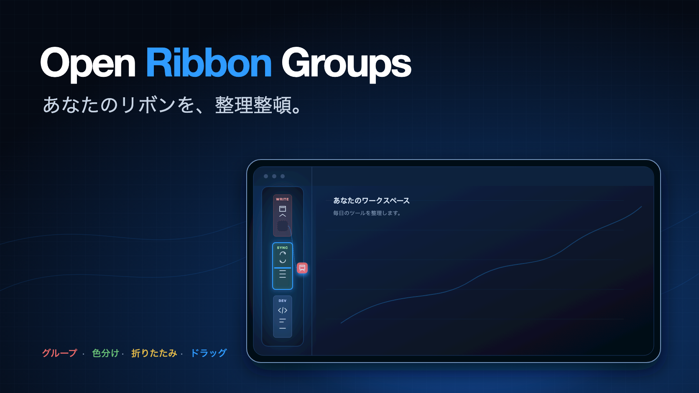

<!-- intl-release: locale-samples
     This file is the Japanese translation of README.md and is expected to
     contain CJK text. English source of truth: README.md -->

<div align="center">

[English](README.md) · [繁體中文](README.zh-TW.md) · [日本語](README.ja.md) · [한국어](README.ko.md)



# Open Ribbon Groups

**Obsidian の左リボンを、名前と色のついたグループに分ける。ボタンはリボン上で直接ドラッグして移せます。**

[](../../releases/latest)
[](../../releases)
[](#動作環境)
[](#動作環境)
[](#プライバシー)
[](LICENSE)

プラグインを十数個も入れると、リボンは関連のないアイコンが縦一列に並んだだけのものになります。
このプラグインは、それを「執筆」「同期」「開発」のようなブロックに分け、色で区切ります。

[📥 ダウンロード](../../releases/latest) · [💡 機能](#機能) · [⚙️ 使い方](#使い方) · [🔄 リボン上でドラッグ](#リボン上でドラッグ) · [🐞 問題を報告](../../issues/new)

</div>

---


## 動作環境

Obsidian 1.8.7 以上。デスクトップ版・モバイル版のどちらでも動きます。

## 機能

- グループごとに背景色（8 色のプリセット）、タイトル、任意のアイコンを設定
- タイトルは自動で縮小 — リボンの幅は 44px しかないため、9px から段階的に下げて
  5 文字が入るようにします。3 文字で切られることはありません
- タイトルかアイコンをクリックでグループを折りたたみ。コマンドで全グループを一括で開閉
- リボン上でグループを右クリックすると、折りたたみ・非表示・この設定画面へ移動
- チェックボックス 1 つでグループごと切り替え — 解体せずにリボンから外せます
- グループに入れていないボタンをすべて隠し、自分で作ったグループだけを残す
- **リボン上でボタンを別のグループへ直接ドラッグ**。移動先のグループが枠線で示され、
  挿入位置に線が出ます
- 設定画面には現在リボンにあるボタンが一覧表示され、まとめて整理できます
- グループ自体もドラッグして並び替え可能
- ドラッグはマウス・ペン・指に対応。設定画面では端まで運ぶと自動スクロール
- ボタンが多い vault では、グループ外の一覧を名前で絞り込み
- 余白を詰めるコンパクト表示。ウィンドウが低いときに多くのグループが収まります
- グループを JSON で書き出し、別の vault に貼り付け
- グループ外のボタンはまとめて、全グループの上か下に配置

## 非表示にする

グループは削除せずにオフにできます。設定画面で名前の横のチェックを外すか、リボン上で
右クリックして「このグループを隠す」を選びます。中のボタンの位置はそのまま残り、
再びオンにすれば元通りです。

「グループ外のボタンを隠す」は、まだ整理していないボタンに対して同じことをします。
両方を使えば、リボンには自分が置いたものだけが残ります。

隠れたボタンは Obsidian から削除されるわけではありません。コマンドパレットからは今までどおり
使えますし、グループをオンに戻せばリボンにも戻ります。

## リボン上でドラッグ

リボンのボタンを押したまま動かします。数ピクセル動かすとボタンが薄くなり、ポインタの下の
グループが枠線で示され、挿入される位置に線が出ます。離すとそこに移ります。

すべてのグループの外へドラッグすると、グループ外の領域に戻ります。ボタンをすべてグループに
入れている場合は狙う先が画面にないため、ドラッグ中だけ一時的な領域が現れ、終わると消えます。

動かさずに押しただけなら通常のクリックのままなので、ボタン本来の動作は変わりません。
ドラッグ中に `Esc` を押すと取り消せます。

> Obsidian にもリボンのドラッグ機能があり、ポインタが動いた瞬間にボタンを別の場所へ移します。
> それはグループ分けと衝突するため、このプラグインは読み込み中それを抑止し、
> ドラッグ操作を自分で処理します。

## 先に知っておいてください

**Obsidian には、リボンのボタンを列挙したり並べ替えたりする公開 API がありません。**
`addRibbonIcon()` は自分のボタンを追加できるだけで、他のプラグインのボタンには触れません。
このプラグインは非公開の `app.workspace.leftRibbon` オブジェクトと、リボン自身の DOM を読みます。

つまり、**Obsidian がその内部構造を変更すれば、このプラグインは動かなくなります**。
その場合は追随する修正が必要です。

黙って壊れることはありません。設定画面に「リボンが見つかりません」と、実際に検出した構造が
表示され、その診断テキストをコピーするボタンから報告できます。

プラグインを無効にすると、リボンは元の状態に戻ります。再起動は不要です。

## プライバシー

このプラグインはネットワーク通信を一切行わず、テレメトリも収集せず、アカウントも不要です。
設定はすべて vault 内のプラグイン自身のフォルダにある `data.json` に保存されます。

インポート欄に貼り付けた設定は、使用前に検証されます。グループの色はリテラルな色指定のみを
受け付けるため、インポートしたファイルが `url()` を紛れ込ませてリボンに外部リクエストを
させることはできません。

設定画面の「開く」ボタンは、そのフォルダをファイルマネージャーで表示します。指し示すのは
常に vault 内のプラグイン自身のフォルダだけで、vault がローカルファイルシステム上に
ない場合（モバイルなど）は表示されません。

## インストール

### コミュニティプラグインから

設定 → コミュニティプラグイン → 閲覧 → 「Open Ribbon Groups」を検索。

### 手動で

最新の [release](https://github.com/aione314159/obsidian-ribbon-groups/releases) から
`main.js`、`styles.css`、`manifest.json` を
`<vault>/.obsidian/plugins/ribbon-groups/` にコピーし、
設定 → コミュニティプラグインで有効化します。

## 使い方

設定 → Open Ribbon Groups：

1. 「グループを追加」をクリックし、名前を付けて背景色を選ぶ
2. 必要なら [Lucide](https://lucide.dev/icons/) のアイコン名（`folder-open` など）を入力
3. 下の「グループ外」の一覧からボタンをドラッグして入れる
4. 左の `⠿` ハンドルでグループの順番を変える


変更は即座に反映されます。保存操作はありません。

リボンでグループのタイトルをクリックすると折りたたまれ、その状態は記憶されます。

## プラグインを無効にしたとき

そのボタンはリボンから消えますが、**位置は設定に残ります**。プラグインを再度有効にすれば、
ボタンは元のグループに戻ります。並べ直す必要はありません。

もう使わないと決めたなら、設定画面の上部に「N 個のボタンが現在リボンにありません」と表示
されるので、「消去」で取り除けます。

## 開発

```bash
npm install
npm run build       # dist/{main.js, styles.css, manifest.json} を生成
npm run dev         # watch モード
npm test            # vitest
npm run typecheck
```

テストが対象とするのは、グループデータの操作（重複排除、グループ削除時のボタンの行き先、
インポートで許可される内容）と、ドロップ判定のすべて — どの領域の何番目に落ちるかを、
リボンと設定画面の両方について検証します。DOM 操作と設定画面の UI は対象外で、
そちらは `ribbonDom.ts` の診断出力で確認します。

コード内のコメントはすべて英語です。ユーザーに見える文字列だけが `src/i18n.ts` の
多言語対応を経由します。

## ライセンス

[MIT](./LICENSE)
