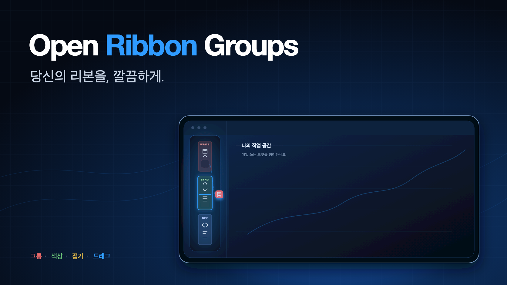
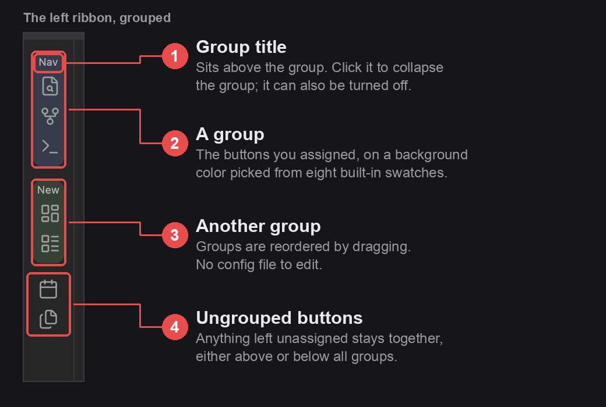
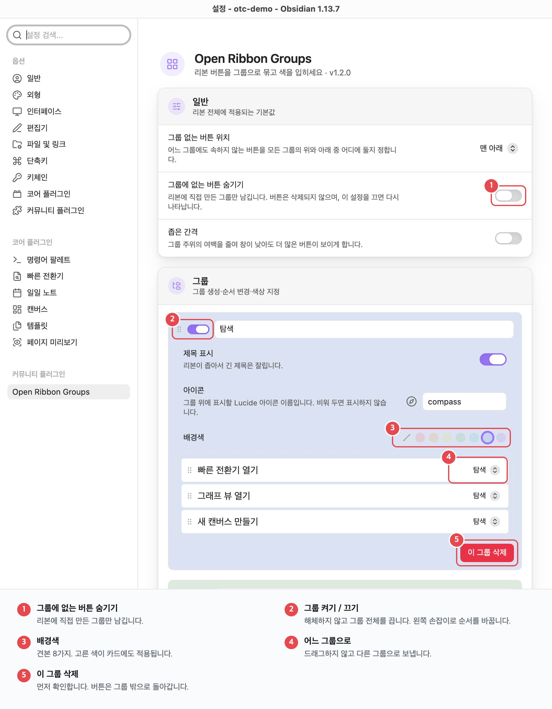

<!-- intl-release: locale-samples
     This file is the Korean translation of README.md and is expected to
     contain CJK text. English source of truth: README.md -->

<div align="center">

[English](README.md) · [繁體中文](README.zh-TW.md) · [日本語](README.ja.md) · [한국어](README.ko.md)



# Open Ribbon Groups

**Obsidian 왼쪽 리본을 이름과 색이 있는 그룹으로 나누고, 버튼은 리본 위에서 바로 끌어 옮기는 플러그인.**

[](../../releases/latest)
[](../../releases)
[](#요구-사항)
[](#요구-사항)
[](#개인-정보)
[](LICENSE)

플러그인을 열 개 남짓 설치하고 나면 리본은 서로 관계없는 아이콘이 한 줄로 늘어선 모습이 됩니다.
이 플러그인은 그것을 "집필", "동기화", "개발" 같은 블록으로 나누고 색으로 구분합니다.

[📥 다운로드](../../releases/latest) · [💡 기능](#기능) · [⚙️ 사용법](#사용법) · [🔄 리본에서 드래그](#리본에서-드래그) · [🐞 문제 신고](../../issues/new)

</div>

---



## 요구 사항

Obsidian 1.8.7 이상. 데스크톱과 모바일 모두에서 동작합니다.

## 기능

- 그룹마다 배경색(기본 제공 8색), 제목, 선택적 아이콘을 지정
- 제목은 자동으로 줄어듭니다 — 리본 폭이 44px뿐이라 9px에서 단계적으로 낮춰
  다섯 글자가 들어가게 합니다. 세 글자에서 잘리지 않습니다
- 제목이나 아이콘을 클릭하면 그룹이 접힙니다. 명령으로 모든 그룹을 한 번에 접거나 펼칠 수 있습니다
- 리본에서 그룹을 우클릭하면 접기, 숨기기, 이 설정 화면으로 바로 이동
- 체크박스 하나로 그룹 전체를 끄기 — 해체하지 않고 리본에서만 내립니다
- 그룹에 넣지 않은 버튼을 모두 숨겨, 직접 만든 그룹만 남기기
- **리본 위에서 버튼을 다른 그룹으로 바로 드래그**. 대상 그룹에 테두리가 생기고
  들어갈 자리에 선이 표시됩니다
- 설정 화면에도 현재 리본의 모든 버튼이 나열되어, 여러 개를 한 번에 정리할 수 있습니다
- 그룹 자체도 드래그해 순서를 바꿀 수 있습니다
- 드래그는 마우스, 펜, 손가락 모두 지원하며 설정 화면에서는 가장자리에서 자동 스크롤됩니다
- 버튼이 많은 보관함에서는 그룹 밖 목록을 이름으로 걸러낼 수 있습니다
- 여백을 줄이는 조밀한 간격. 창이 낮을 때 더 많은 그룹이 들어갑니다
- 그룹을 JSON으로 내보내 다른 보관함에 붙여넣기
- 그룹에 없는 버튼은 한데 모여 모든 그룹의 위나 아래에 놓입니다

## 숨기기

그룹은 삭제하지 않고 끌 수 있습니다. 설정 화면에서 이름 옆 체크를 해제하거나, 리본에서
우클릭해 "이 그룹 숨기기"를 고르세요. 안에 있는 버튼의 자리는 그대로 남고, 다시 켜면
원래대로 돌아옵니다.

"그룹에 없는 버튼 숨기기"는 아직 정리하지 않은 버튼에 같은 일을 합니다. 둘을 함께 쓰면
리본에는 직접 올려둔 것만 남습니다.

숨겨진 버튼이 Obsidian에서 삭제되는 것은 아닙니다. 명령 팔레트에서는 그대로 쓸 수 있고,
그룹을 다시 켜면 리본에도 돌아옵니다.

## 리본에서 드래그

리본 버튼을 누른 채 움직이세요. 몇 픽셀을 넘기면 버튼이 흐려지고, 포인터 아래 그룹에
테두리가 생기며, 들어갈 자리에 선이 나타납니다. 놓으면 거기로 옮겨집니다.

모든 그룹 밖으로 끌어내면 그룹에 없는 영역으로 돌아갑니다. 버튼을 전부 그룹에 넣어 두었다면
겨눌 영역이 화면에 없으므로, 드래그하는 동안만 임시 영역이 나타났다가 끝나면 사라집니다.

움직이지 않고 누르기만 하면 평범한 클릭 그대로라, 버튼 본래의 동작은 달라지지 않습니다.
드래그 중에 `Esc`를 누르면 취소됩니다.

> Obsidian에도 리본 드래그 기능이 있어 포인터가 움직이는 순간 버튼을 다른 곳으로 옮깁니다.
> 그것이 그룹 나누기와 충돌하므로, 이 플러그인은 로드되어 있는 동안 그 동작을 막고
> 드래그를 직접 처리합니다.

## 먼저 읽어 주세요

**Obsidian에는 리본 버튼을 나열하거나 재배치하는 공개 API가 없습니다.** `addRibbonIcon()`은
자기 버튼을 추가할 수 있을 뿐, 다른 플러그인의 버튼에는 손댈 수 없습니다. 이 플러그인은
비공개 `app.workspace.leftRibbon` 객체와 리본 자체의 DOM을 읽습니다.

즉, **Obsidian이 그 내부 구조를 바꾸면 이 플러그인은 동작하지 않게 됩니다**.
그때는 따라가는 수정이 필요합니다.

조용히 망가지지는 않습니다. 설정 화면에 "리본을 찾을 수 없음"과 실제로 감지한 구조가
표시되고, 그 진단 텍스트를 복사하는 버튼으로 신고할 수 있습니다.

플러그인을 비활성화하면 리본은 원래 상태로 돌아갑니다. 재시작은 필요 없습니다.

## 개인 정보

이 플러그인은 네트워크 요청을 전혀 하지 않고, 텔레메트리를 수집하지 않으며, 계정도 필요 없습니다.
모든 설정은 보관함 안 플러그인 자체 폴더의 `data.json`에 저장됩니다.

가져오기 칸에 붙여넣은 설정은 사용 전에 검증됩니다. 그룹 색은 리터럴 색 표기만 받아들이므로,
가져온 파일이 `url()`을 몰래 넣어 리본이 외부로 요청을 보내게 만들 수 없습니다.

설정 화면의 "열기" 버튼은 그 폴더를 파일 관리자에서 보여 줍니다. 가리키는 곳은 언제나
보관함 안 플러그인 자체 폴더뿐이며, 보관함이 로컬 파일 시스템에 있지 않을 때(예: 모바일)는
표시되지 않습니다.

## 설치

### 커뮤니티 플러그인에서

설정 → 커뮤니티 플러그인 → 탐색 → "Open Ribbon Groups" 검색.

### 수동으로

최신 [release](https://github.com/aione314159/obsidian-ribbon-groups/releases)에서
`main.js`, `styles.css`, `manifest.json`을
`<vault>/.obsidian/plugins/ribbon-groups/`에 복사한 뒤,
설정 → 커뮤니티 플러그인에서 활성화하세요.

## 사용법

설정 → Open Ribbon Groups:

1. "그룹 추가"를 눌러 이름을 정하고 배경색을 고릅니다
2. 필요하면 [Lucide](https://lucide.dev/icons/) 아이콘 이름(`folder-open` 등)을 입력합니다
3. 아래 "그룹에 없음" 목록에서 버튼을 끌어다 넣습니다
4. 왼쪽 `⠿` 손잡이로 그룹 순서를 바꿉니다



변경은 즉시 반영됩니다. 저장할 것이 없습니다.

리본에서 그룹 제목을 클릭하면 접히고, 그 상태는 기억됩니다.

## 플러그인을 비활성화했을 때

그 버튼은 리본에서 사라지지만, **위치는 설정에 남습니다**. 해당 플러그인을 다시 켜면
버튼은 원래 그룹으로 돌아옵니다. 다시 배치할 필요가 없습니다.

더는 쓰지 않기로 했다면, 설정 화면 위쪽에 "N개의 버튼이 현재 리본에 없습니다"가 표시되니
"지우기"로 정리하세요.

## 개발

```bash
npm install
npm run build       # dist/{main.js, styles.css, manifest.json} 생성
npm run dev         # watch 모드
npm test            # vitest
npm run typecheck
```

테스트는 그룹 데이터 조작(중복 제거, 그룹 삭제 시 버튼의 행선지, 가져오기에서 허용되는 내용)과
드롭 판정 전체 — 어느 영역의 몇 번째에 놓이는지를 리본과 설정 화면 양쪽에 대해 확인합니다.
DOM 조작과 설정 화면 UI는 대상이 아니며, 그쪽은 `ribbonDom.ts`의 진단 출력으로 확인합니다.

코드 주석은 모두 영어입니다. 사용자에게 보이는 문자열만 `src/i18n.ts`의 다국어를 거칩니다.

## 라이선스

[MIT](./LICENSE)
