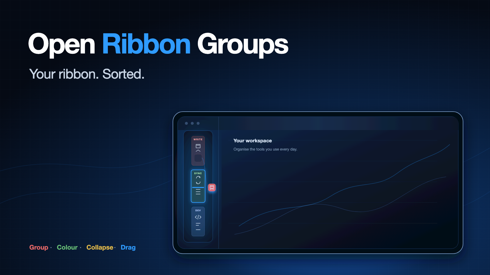
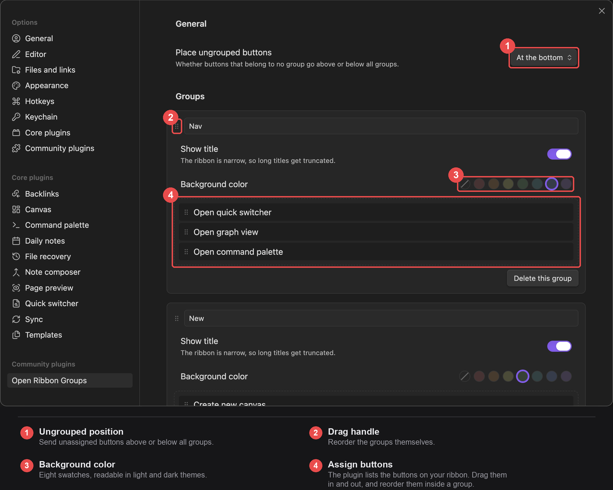

<div align="center">

[English](README.md) · [繁體中文](README.zh-TW.md) · [日本語](README.ja.md) · [한국어](README.ko.md)



# Open Ribbon Groups

**An Obsidian plugin that splits the left ribbon into labeled, color-coded groups — and lets you drag buttons between them on the ribbon itself.**

[](../../releases/latest)
[](../../releases)
[](#requirements)
[](#requirements)
[](#privacy)
[](LICENSE)

Once you have a dozen plugins installed, the ribbon turns into one long column of unrelated
icons. This plugin lets you split it into blocks such as "Writing", "Sync" and "Dev",
separated by color.

[📥 Download](../../releases/latest) · [💡 Features](#features) · [⚙️ Usage](#usage) · [🔄 Drag on the ribbon](#drag-on-the-ribbon) · [🐞 Report an issue](../../issues/new)

</div>

---


## Requirements

Obsidian 1.8.7 or later, on desktop or mobile.

## Features

- Groups, each with a background color (eight built-in swatches), a title and an optional icon
- Group titles shrink to fit — the ribbon is only 44px wide, so the label steps down from 9px
  until five characters fit instead of being cut off after three
- Click a title or icon to collapse the whole group; commands collapse or expand every group at once
- Right-click a group on the ribbon to collapse it, hide it, or jump straight to these settings
- Switch a whole group off with one checkbox — it leaves the ribbon without being broken up
- Hide every ungrouped button, so the ribbon shows only the groups you built
- **Drag buttons between groups on the ribbon itself**, with the target group outlined and an
  insertion line where the button will land
- The settings tab also lists every button on your ribbon, for arranging several at a time
- Groups themselves can be dragged to change their order
- Dragging works with a mouse, a pen or a finger, and scrolls the settings pane when you reach its edge
- Filter the ungrouped list by name when a vault has more buttons than fit on screen
- Compact spacing, for when a short window cannot fit every group
- Copy your groups out as JSON and paste them into another vault
- Ungrouped buttons stay together, either above or below all groups
- English, Traditional Chinese, Simplified Chinese, Japanese and Korean, following the
  language set in Obsidian

## Hiding

A group can be switched off without being deleted: uncheck the box next to its name in
settings, or right-click it on the ribbon and choose "Hide group". Its buttons keep their
places, and turning it back on restores the group exactly as it was.

"Hide ungrouped buttons" does the same for everything you have not sorted yet. Together they
turn the ribbon into a list of only what you chose to put there.

Hidden buttons are not removed from Obsidian — they still work from the command palette, and
they come back the moment you switch the group on again.

## Drag on the ribbon

Press a ribbon button and move it. Past a few pixels the button fades, the group under the
pointer is outlined, and a line shows where it will be inserted. Release to drop it there.

Dragging a button out of every group drops it back into the ungrouped area. When all of your
buttons are grouped there is no ungrouped block on screen to aim at, so one appears for the
duration of the gesture and goes away afterwards.

A press that never moves is still a plain click, so buttons keep doing what they always did.
Press `Esc` during a drag to cancel it.

> Obsidian has its own ribbon drag, which reparents the button the moment the pointer moves.
> That fights with the grouping, so this plugin suppresses it while it is loaded and handles
> the gesture instead.

## Please read this first

**Obsidian has no public API for listing or reordering ribbon buttons.** `addRibbonIcon()`
only adds your own button; it cannot touch anyone else's. This plugin reads the private
`app.workspace.leftRibbon` object plus the ribbon's own DOM.

That means: **if Obsidian changes that internal structure, this plugin will break** and will
need a fix to follow along.

It will not fail silently. The settings tab shows "Ribbon not found" together with the
structure it actually detected, and a button to copy that diagnostic text so you can file
an issue.

Disabling the plugin restores the ribbon to its original state — no restart needed.

## Privacy

This plugin makes no network requests, collects no telemetry, and requires no account.
All settings live in `data.json` inside the plugin's own folder in your vault.

Settings you paste into the import box are validated before they are used: group colors are
restricted to literal color syntax, so an imported file cannot smuggle in a `url()` that
would make your ribbon fetch something.

The settings tab has an "Open" button that reveals that folder in your system file manager.
It only ever points at the plugin's own folder inside the vault, and it is hidden when the
vault is not backed by a local file system (for example on mobile).

## Install

### From the community directory

Settings → Community plugins → Browse → search for "Open Ribbon Groups".

### Manually

Copy `main.js`, `styles.css` and `manifest.json` from the latest
[release](https://github.com/aione314159/obsidian-ribbon-groups/releases) into
`<vault>/.obsidian/plugins/ribbon-groups/`, then enable it under
Settings → Community plugins.

## Usage

Settings → Open Ribbon Groups:

1. Click "Add group", give it a name and pick a background color
2. Optionally type a [Lucide](https://lucide.dev/icons/) icon name, such as `folder-open`
3. Drag buttons from the "Ungrouped" list below into it
4. Use the `⠿` handle on the left to reorder groups



Changes apply immediately; there is nothing to save.

Clicking a group title in the ribbon collapses it, and the collapsed state is remembered.

## When a plugin gets disabled

Its button disappears from the ribbon, but **its position is kept in the settings**. Re-enable
that plugin and the button returns to its original group — no need to rearrange anything.

If you are sure you are done with it, the settings tab shows "N buttons are no longer on the
ribbon" at the top; click "Clear" to drop them.

## Development

```bash
npm install
npm run build       # produces dist/{main.js, styles.css, manifest.json}
npm run dev         # watch mode
npm test            # vitest
npm run typecheck
```

Tests cover the group data operations (deduplication, where buttons go when a group is
deleted, what an import is allowed to contain) and the whole drop decision — which zone a
release lands in and at which index, on the ribbon as well as in the settings pane. DOM
manipulation and the settings UI are out of scope; those are verified through the diagnostic
output in `ribbonDom.ts`.

## License

[MIT](./LICENSE)
