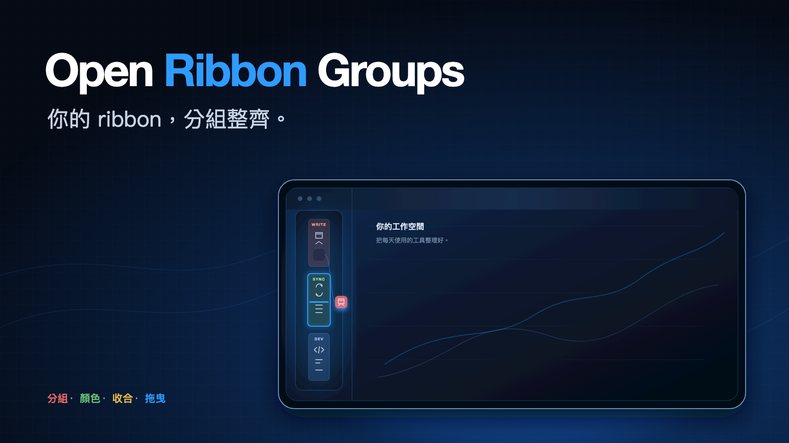

<!-- intl-release: locale-samples
     This file is the Traditional Chinese translation of README.md and is
     expected to contain CJK text. English source of truth: README.md -->

<div align="center">

[English](README.md) · [繁體中文](README.zh-TW.md) · [日本語](README.ja.md) · [한국어](README.ko.md)



# Open Ribbon Groups

**把 Obsidian 左側 ribbon 分成有標題、有顏色的群組，而且可以直接在 ribbon 上把按鈕拖到別組。**

[](../../releases/latest)
[](../../releases)
[](#系統需求)
[](#系統需求)
[](#隱私)
[](LICENSE)

裝了十幾個插件之後，ribbon 會變成一長條看不出關聯的圖示。這個插件讓你把它們分成
「寫作」「同步」「開發」之類的區塊，用顏色隔開。

[📥 下載](../../releases/latest) · [💡 功能](#功能) · [⚙️ 使用](#使用) · [🔄 在 ribbon 上拖曳](#在-ribbon-上拖曳) · [🐞 回報問題](../../issues/new)

</div>

---


## 系統需求

Obsidian 1.8.7 以上，桌面版與行動版皆可。

## 功能

- 分組，每組可設背景色（八個內建色票）、標題與圖示
- 標題會自動縮小字級——ribbon 只有 44px 寬，字級從 9px 逐步往下調，讓五個字塞得進去，
  而不是三個字就被截斷
- 點標題或圖示收合整組；另有指令一次收合或展開全部
- 在 ribbon 上對群組按右鍵，可以收合、隱藏，或直接跳到這個設定頁
- 一個 checkbox 就能把整組關掉——它會離開 ribbon，但不會被拆散
- 隱藏所有未分組的按鈕，ribbon 上只留下你自己分的組
- **直接在 ribbon 上把按鈕拖到別組**，過程中目標群組會描邊，並顯示按鈕會插進去的位置
- 設定頁也列出目前 ribbon 上的每一顆按鈕，適合一次整理多個
- 分組本身也能拖曳調整先後
- 拖曳支援滑鼠、觸控筆與手指，在設定頁拖到邊緣會自動捲動
- 按鈕多時可用名稱篩選未分組清單
- 緊湊間距模式，視窗不高時放得下更多分組
- 把分組匯出成 JSON，貼到另一個 vault
- 未分組的按鈕自動聚在一起，可選擇擺最上面或最下面
- 介面跟著 Obsidian 的語系走：英文、繁中、簡中、日文、韓文

## 隱藏

群組可以關掉而不必刪除：在設定頁把名稱旁邊的 checkbox 取消勾選，或在 ribbon 上按右鍵
選「隱藏這一組」。組內按鈕的位置都保留著，再打開就完全恢復原狀。

「隱藏未分組按鈕」對還沒整理的按鈕做同一件事。兩個一起用，ribbon 上就只剩下你放進去的東西。

被隱藏的按鈕沒有從 Obsidian 移除——它們在命令面板裡照樣能用，把群組打開就會回到 ribbon 上。

## 在 ribbon 上拖曳

按住 ribbon 上的按鈕移動。超過幾個像素之後按鈕會淡化，指標所在的群組會描邊，
並顯示按鈕將插入的位置。放開就落在那裡。

把按鈕拖出所有群組，它會回到未分組區。如果你的按鈕全都分好組了，畫面上沒有未分組區可以瞄準，
拖曳期間會臨時出現一塊，結束後自動消失。

沒有移動的按壓仍然是一次正常點擊，按鈕原本的功能不受影響。拖曳中按 `Esc` 可以取消。

> Obsidian 自己也有 ribbon 拖曳，指標一動它就把按鈕搬離原位。那會跟分組打架，
> 所以這個插件在載入期間會擋掉它，改由自己處理這個手勢。

## 先知道這件事

**Obsidian 沒有公開 API 可以列舉或重排 ribbon 的按鈕。** `addRibbonIcon()` 只能新增
自己的按鈕，動不了別人的。這個插件走的是 `app.workspace.leftRibbon` 這個私有物件，
加上 ribbon 自己的 DOM。

意思是：**Obsidian 改版動到那塊結構，這個插件就會失效**，需要跟著修。

失效時不會靜默不動作——設定頁會顯示「找不到 ribbon」以及實際偵測到的結構，
按一下就能複製那段診斷資訊。

停用插件時 ribbon 會還原成原本的樣子，不需要重開 Obsidian。

## 隱私

這個插件不發任何網路請求、不收集任何遙測資料、不需要帳號。
所有設定都放在 vault 內插件自己資料夾裡的 `data.json`。

貼進匯入框的設定會先驗證過才使用：分組顏色只接受字面色值，
匯入的檔案沒辦法夾帶 `url()` 讓你的 ribbon 去抓外部資源。

設定頁的「開啟」按鈕會在檔案管理員裡顯示那個資料夾。它只會指向 vault 內插件自己的資料夾，
而且當 vault 不是放在本機檔案系統上時（例如行動裝置）會自動隱藏。

## 安裝

從社群插件市集搜尋「Open Ribbon Groups」，或手動安裝：

從最新一版
[release](https://github.com/aione314159/obsidian-ribbon-groups/releases)
下載 `main.js`、`styles.css`、`manifest.json`，放進
`<vault>/.obsidian/plugins/ribbon-groups/`，再到「設定 → 第三方插件」啟用。

自己編譯的話，`npm run build` 之後把 `dist/` 底下那三個檔案複製過去即可。

## 使用

「設定 → Open Ribbon Groups」：

1. 按「新增分組」建一組，填名稱、選背景色
2. 需要的話填一個 [Lucide](https://lucide.dev/icons/) 圖示名稱，例如 `folder-open`
3. 從下方「未分組」清單把按鈕拖進去
4. 用左邊的 `⠿` 把手調整分組先後


改動即時生效，不需要按儲存。

在 ribbon 上點分組標題可以收合，收合狀態會記住。

## 某個插件被停用之後

它的按鈕會從 ribbon 上消失，但**位置會留在設定裡**。重新啟用那個插件時，按鈕會回到
原本的組，不必重排。

確定不會再用的話，設定頁上方會出現「有 N 個按鈕目前不在 ribbon 上」，按「清掉」移除。

## 開發

```bash
npm install
npm run build       # 產出 dist/{main.js, styles.css, manifest.json}
npm run dev         # watch 模式
npm test            # vitest
npm run typecheck
```

測試涵蓋分組資料的操作（去重、刪組後按鈕的去向、匯入允許哪些內容），以及完整的
放置判定——放開時落在哪一區、插在第幾個，ribbon 與設定頁兩邊都測。DOM 操作與設定頁 UI
不在測試範圍，那部分靠 `ribbonDom.ts` 的診斷輸出來確認。

程式碼註解一律用英文，使用者看得到的文字才走 `src/i18n.ts` 的多語系。

## 授權

[MIT](./LICENSE)
